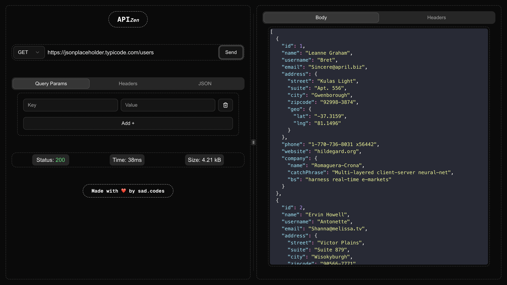
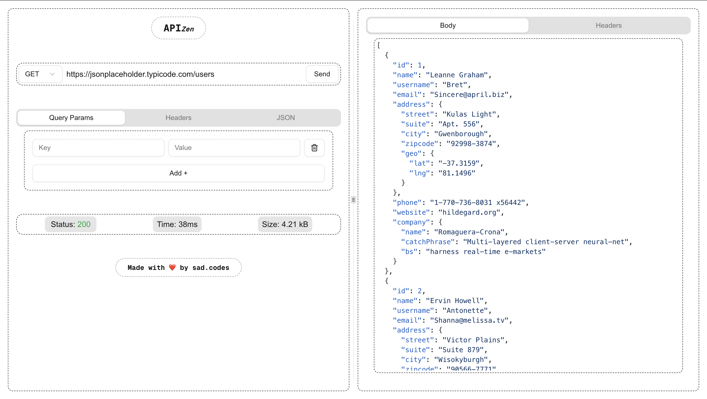

# APIzen

APIzen is a lightweight and intuitive API testing tool built using Next.js, Axios, Tailwind CSS, ShadCN for UI components, and React Code Blocks for code highlighting. It allows developers to send HTTP requests and view responses with a clean and interactive UI.

## ✨ Features

- Supports all major HTTP request methods (GET, POST, PUT, DELETE, etc.)
- Add custom query parameters and headers effortlessly
- Edit and send JSON body payloads with syntax highlighting
- View real-time response with:
  - Status Code
  - Response Time
  - Response Size
- Dynamic response body and headers display
- Theme support (Dark/Light mode)
- Intuitive and responsive UI for seamless API testing

---

## 🛠️ Technologies Used

- **Next.js** – Framework for server-side rendering and static site generation
- **Axios** – HTTP client for making API requests
- **Tailwind CSS** – Utility-first CSS framework for styling
- **ShadCN** – Prebuilt UI components based on Radix
- **React Code Blocks** – Code highlighting with themes
- **CodeMirror** – JSON editor with syntax highlighting
- **Lucide React** – Icon library for UI elements
- **Sonner** – Toast notifications for error/success messages

---

## 🚀 Getting Started

### Prerequisites

- Node.js v18+
- npm or yarn installed

### Installation

1. **Clone the repository:**
```bash
git clone https://github.com/your-username/APIzen.git
```

2. **Navigate to the project directory:**
```bash
cd APIzen
```

3. **Install dependencies:**
```bash
npm install
# or
yarn install
```

4. Start the development server:
   ```bash
   npm run dev
   ```

Open [http://localhost:3000](http://localhost:3000) to view the app in your browser.

---

## 🎯 How to Use APIzen
1. **Select HTTP Method:** Choose the desired request method from the dropdown.
2. **Enter URL:** Input the API endpoint URL.
3. **Add Query Parameters:** Define key-value pairs as query params.
4. **Add Headers:** Define custom headers if required.
5. **Add JSON Body:** If the request requires a payload, add JSON data with auto-formatting.
6. **Send Request:** Click the Send button to execute the request.
7. **View Response:** See the formatted response body and headers displayed dynamically.

---

## 🖥️ Screenshots
- 🌑 **Dark Mode**



- 🌕 **Light Mode**



---

Made with ❤️ by [sad.codes](https://github.com/sad-codes)
